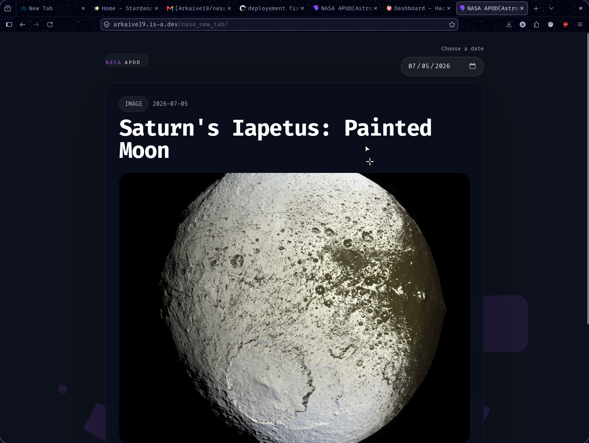

# NASA New Tab

A NASA astronaut picture of the day (APOD) new tab website.



## Built for stardance

This project is a mission guide submission for Hack Club's Stardance. I wanted to try out the missions offered by hackclub is akk

## Built With

- **Framework:** React / Vite (vanilla)
- **Data Source:** NASA Open APIs

### Installation

1. Clone this repository to your local directory.
2. Navigate into the project folder:
   ```bash
   cd ~/path/to/newTab
   ```
3. Install the dependencies:
   ```bash
   npm install
   ```
4. Start the local development server:
   ```bash
   npm run dev
   ```
